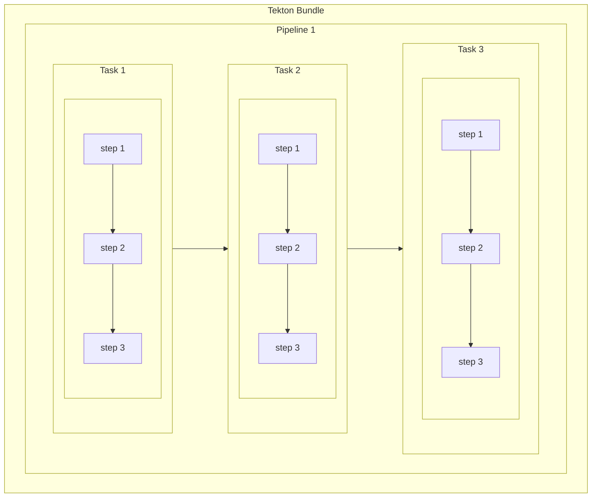
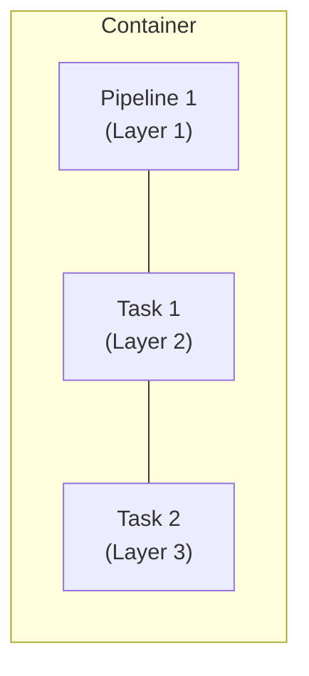
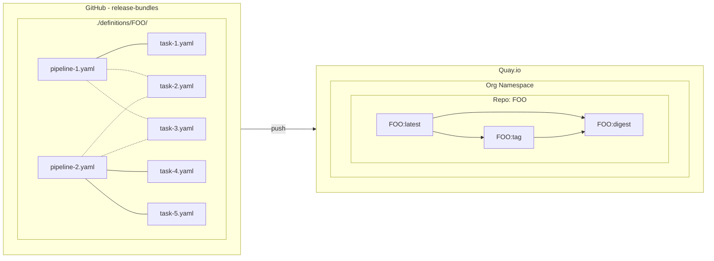

# release-bundles

This repo stores Tekton bundle definition (yaml) sources for the HACBS release-service.

## Tekton bundles
Tekton Bundles are a collection of Pipelines & Tasks stored within container images.

Conceptually a bundle may resemble something like the following diagram:
---

Each Tekton Pipeline or Task CDR definition is stored as a layer in the container image.

---

### Creating Tekton Bundles in release-bundles repo
* Creating a Teton bundle is as easy as creating a new directory under `definitions/[BUNDLE_NAME]` directory.
* The name of the directory becomes the name of the Tekton bundle from the image registry perspective.
* YAML definitions for Pilelines & Task can be kept in a single file, delineated by `---` document-start, and optionally `...` document-end symbols.
* Or alternatively, YAML definitions can be kepts in separate files; the CI will merge them all into the bundle. This way discrete tasks used within a pipeline could be reused like building-blocks. For example, a task to clone a git repository could be used in multiple pipelines within a bundle.
* Generated bundles will be tagged with the git sha-1 commit from main branch, and also tagged with "main" attributing the branch the commit was merged into.
* YAML linting is used to ensure all bundle definitions conform to a set of style standards enforced by CI. Please review the config file `.yamllint` for more details, and review [upstream documentation](https://yamllint.readthedocs.io/en/stable/). If the need occurs rules could be disabled perline within the YAML file, for example suppressing long-line errors where line-breaks are not feasible.

---

### The workflow resembles the following graph

